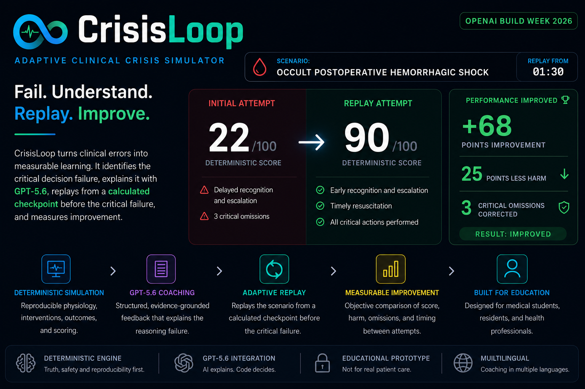
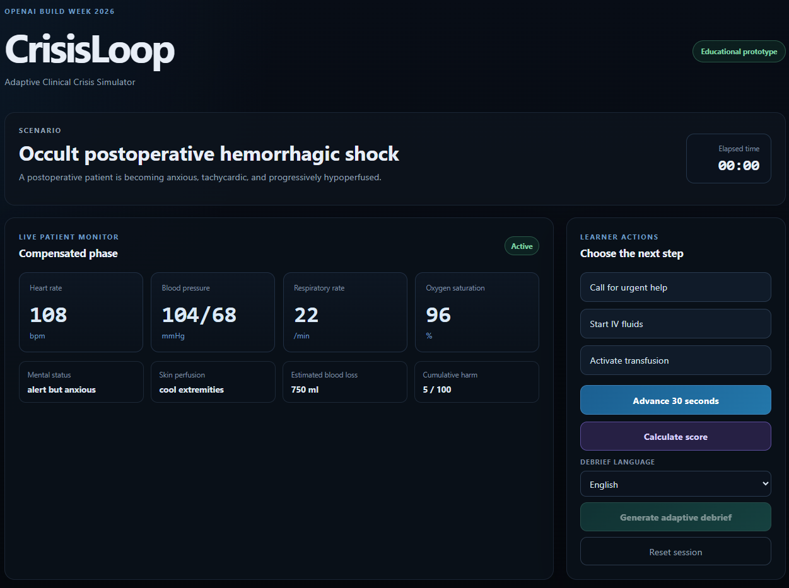
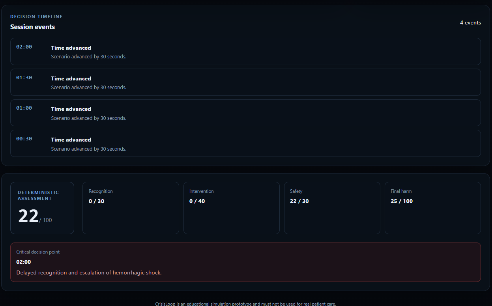
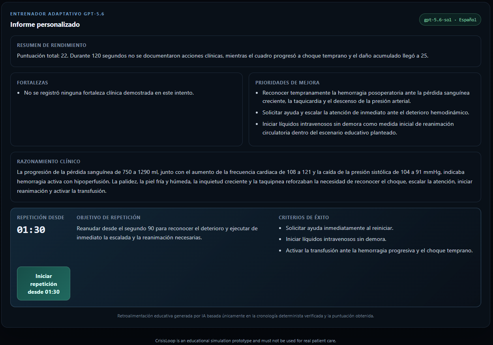
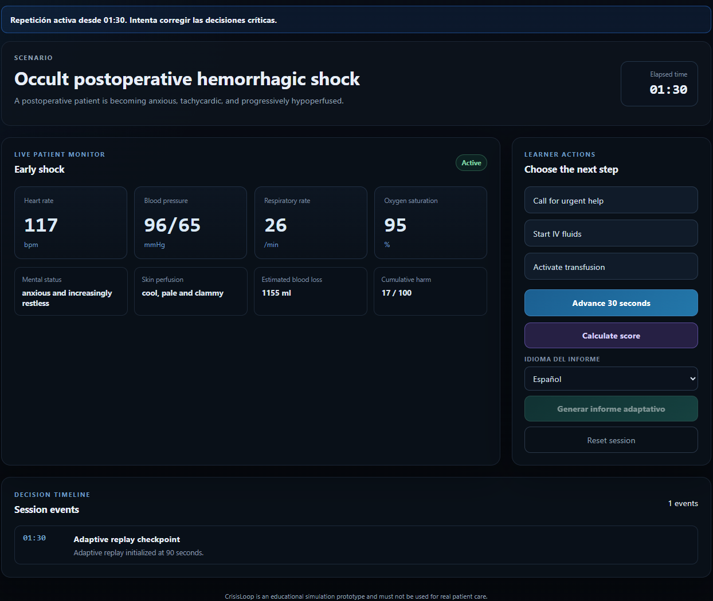
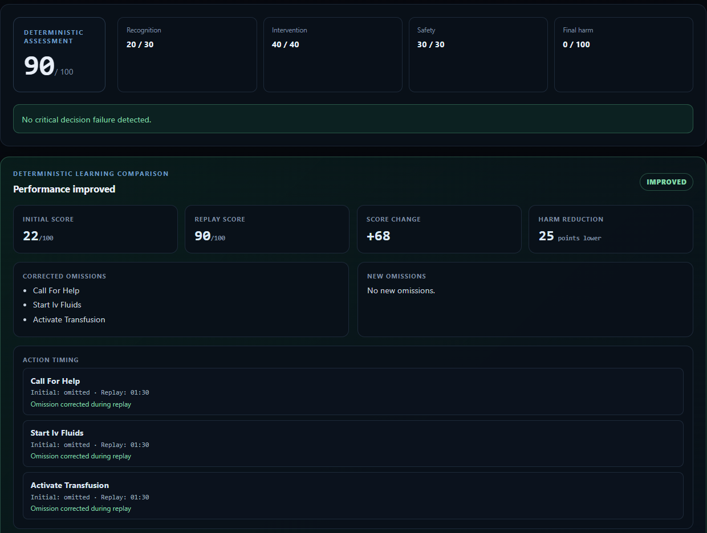

# CrisisLoop

<p align="center">
  
</p>

<p align="center">
  <strong>Fail. Understand. Replay. Improve.</strong>
</p>

<p align="center">
  <a href="https://crisisloop-build-week-2026.vercel.app"><strong>Open the live application</strong></a>
  ·
  <a href="https://crisisloop-api.onrender.com/health">API health check</a>
</p>

**Adaptive Clinical Crisis Simulator**

CrisisLoop is an educational simulation prototype built for OpenAI Build Week 2026.

It trains clinical decision-making under pressure by combining a deterministic patient simulation with structured GPT-5.6 adaptive coaching.

## Core learning loop

1. The learner manages a time-sensitive clinical crisis.
2. A deterministic engine advances the patient's physiological state.
3. Every action, omission and delay is recorded.
4. A deterministic scoring engine evaluates performance.
5. CrisisLoop identifies the critical decision point.
6. GPT-5.6 analyzes only the verified timeline and score.
7. The system generates structured adaptive feedback.
8. The learner replays the crisis from shortly before the failure.
9. The learner attempts a corrected sequence of decisions.

## Initial scenario

The Build Week MVP focuses on one scenario:

**Occult postoperative hemorrhagic shock**

The learner must recognize progressive hypoperfusion and initiate timely escalation and resuscitation.

## Why CrisisLoop

Traditional assessments often test whether learners know the correct answer.

CrisisLoop evaluates whether they can:

- recognize deterioration;
- prioritize information;
- act under time pressure;
- avoid diagnostic anchoring;
- recover from a critical error;
- improve during immediate deliberate practice.

## Architecture

- React and TypeScript frontend.
- FastAPI backend.
- Deterministic scenario engine.
- Physiological state machine.
- Timed action and event log.
- Deterministic scoring.
- Critical decision detector.
- GPT-5.6 adaptive coach.

## Deterministic simulation

GPT-5.6 does not control:

- vital signs;
- physiological progression;
- intervention effects;
- safety rules;
- clinical outcomes;
- scores;
- mathematical pre/post comparison.

These components are deterministic, reproducible, and testable.

## GPT-5.6 integration

GPT-5.6 analyzes the verified simulation timeline and deterministic score to:

- summarize performance;
- identify evidence-based strengths;
- explain missed clinical cues;
- define improvement priorities;
- generate a replay objective;
- establish measurable success criteria.

Model responses use validated structured output. GPT-5.6 does not control physiology, intervention effects, safety rules, patient outcomes, scores or replay timing.


## Product walkthrough

### 1. Initial clinical crisis

The learner begins with a postoperative patient showing early signs of deterioration.

<p align="center">
  
</p>

### 2. Deterministic failure assessment

The simulation engine calculates the physiological consequences, score, harm and critical decision point without language-model control.

<p align="center">
  
</p>

### 3. Grounded multilingual GPT-5.6 coaching

GPT-5.6 receives only the verified timeline, deterministic score, omissions and replay checkpoint. It generates structured educational feedback without changing simulation truth.

<p align="center">
  
</p>

### 4. Adaptive replay

The learner resumes from a calculated checkpoint before the critical failure instead of restarting the entire scenario.

<p align="center">
  
</p>

### 5. Quantified improvement

CrisisLoop deterministically compares both attempts across score, harm, omissions and action timing.

<p align="center">
  
</p>

Validated public result:

- initial score: `22/100`;
- replay score: `90/100`;
- score improvement: `+68`;
- harm reduction: `25 points`;
- corrected critical omissions: `3`;
- new omissions: `0`;
- deterministic classification: `IMPROVED`.

## Repository structure

- `frontend/`: browser interface.
- `backend/`: API, simulation engine, scoring, schemas and coaching.
- `backend/app/engine/`: deterministic scenario and replay engine.
- `docs/`: architecture, validation and submission materials.
- `render.yaml`: backend deployment configuration.
- `BUILD_WEEK_SCOPE.md`: frozen competition scope.
- `PROJECT_STATUS.md`: current operational state.
- `DECISIONS.md`: product and architecture decisions.
- `CHANGELOG.md`: chronological development history.

## Current status

A functional public browser MVP is deployed and available for evaluation.

Implemented capabilities include deterministic physiological progression, learner actions, decision timeline, deterministic scoring, critical decision detection, structured GPT-5.6 multilingual coaching, adaptive replay from the calculated pre-failure checkpoint, and deterministic comparison between attempts.

Current validation baseline:

- 44 automated backend and API tests passing;
- frontend production build successful;
- real GPT-5.6 structured output verified;
- complete public simulation, debrief, replay and comparison workflow verified in the browser.


## Public deployment

- Application: `https://crisisloop-build-week-2026.vercel.app`
- API: `https://crisisloop-api.onrender.com`
- API health check: `https://crisisloop-api.onrender.com/health`

The public end-to-end workflow has been verified:

**simulation → deterministic score → GPT-5.6 debrief → adaptive replay → quantified improvement**

Validated public result:

- initial score: `22/100`;
- replay score: `90/100`;
- score delta: `+68`;
- harm reduction: `25 points`;
- corrected omissions: `3`;
- new omissions: `0`.

The free Render instance may require a short cold start after inactivity.

## Local development and validation

Copy `.env.example` to `.env`, provide `OPENAI_API_KEY` only if testing the
adaptive coach, and install the pinned backend dependencies:

```bash
python -m venv .venv
.venv/bin/pip install -r requirements.txt
.venv/bin/python -m uvicorn backend.app.main:app --reload
```

In a separate shell, start the frontend:

```bash
cd frontend
npm ci
npm run dev
```

Run the automated validation from the repository root:

```bash
.venv/bin/python -m pytest -q
cd frontend
npm run lint
npm run build
```

For production, configure `OPENAI_API_KEY`, `CRISISLOOP_COACH_MODEL`, and
`CRISISLOOP_ALLOWED_ORIGINS` on the backend, and provide
`VITE_API_BASE_URL` when building the frontend. Never expose the OpenAI API key
through a `VITE_` variable.

## Safety notice

CrisisLoop is an educational simulation prototype.

It is not a medical device, diagnostic tool, clinical decision support system, or substitute for professional supervision. It must not be used for real patient care.

## Build Week objective

Deliver a browser-based MVP in which a judge can:

1. complete a simulated clinical crisis;
2. observe deterministic consequences;
3. review the critical decision timeline;
4. receive structured adaptive coaching;
5. replay the crisis from the calculated pre-failure checkpoint;
6. attempt a corrected sequence of decisions.
